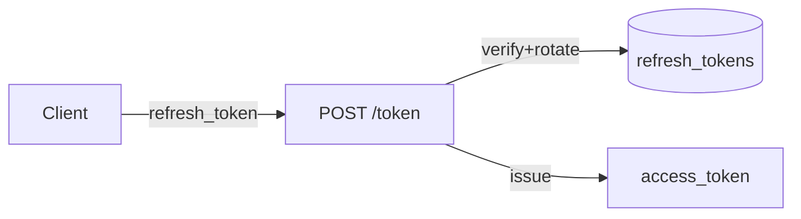

# Auth Module (NovoLogic)

- OIDC Provider at `https://auth.novologic.co`
- REST: `/.well-known/openid-configuration`, `/jwks.json`, `/authorize`, `/token`, `/userinfo`, `/introspect`, `/revoke`
- GraphQL management at `/graphql` for tenants and users
- Sessions + refresh rotation, MFA (TOTP), RBAC, audit logging

Mermaid (Session Rotation)

