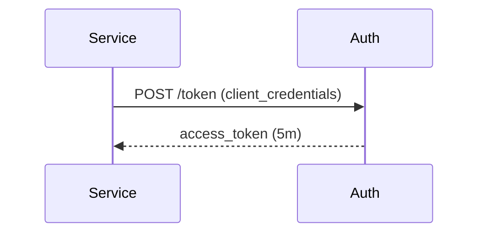

# Auth Module (NovoLogic)

- OIDC Provider at `https://auth.novologic.co`
- REST: `/.well-known/openid-configuration`, `/jwks.json`, `/authorize`, `/token`, `/userinfo`, `/introspect`, `/revoke`
- GraphQL management at `/graphql` for tenants and users
- Sessions + refresh rotation, MFA (TOTP), RBAC, audit logging
 - Machine-to-machine via `client_credentials` (JWT 5m, no refresh)

Notes:
- First‑party refresh: `/token` will read `rt` HttpOnly cookie if `refresh_token` body param is absent.
- Tenant safety: requests for suspended tenants are blocked by `TenantStatusGuard`.
- Caching: in‑memory LRU for permissions (60s) and imported JWKS public keys (5m); swappable for Redis later.

See also (module docs for front‑end):
- `src/modules/auth/FRONTEND_GUIDE.md`
- `src/modules/auth/MODULE_DOC.md`

Module map
- Root `AuthModule` aggregates: `OidcModule`, `SessionsModule`, `ClientsModule`, `PasswordsModule`, `MfaModule`, `RbacModule`, `TokensModule`, `ManagementModule`, `AuditModule`
- Import once in `AppModule` for all auth capabilities

Mermaid (Session Rotation)

Mermaid (Client Credentials)

