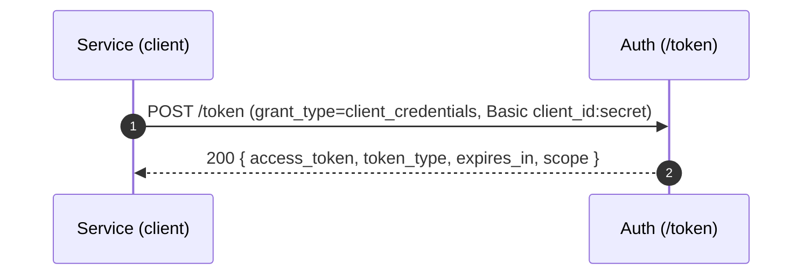
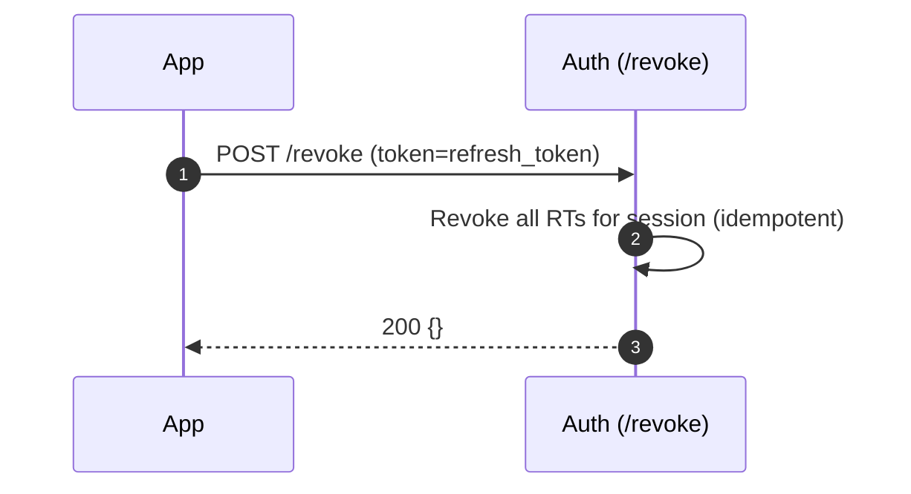

## What this module provides
- OIDC Provider at `https://auth.novologic.co` (REST) for user login/session:
  - `/.well-known/openid-configuration`, `/jwks.json`
  - `/authorize` (code + PKCE), `/token` (code→token, refresh), `/userinfo`, `/introspect`, `/revoke`
  - `/login` (HTML form), `/consent` (HTML confirm scopes)
- GraphQL Admin API at `/graphql` (for internal consoles / back‑office):
  - `tenants()` list, `users(tenantId)`, `registerUser(input)` (more admin CRUD to be added)
- Sessions & refresh rotation, MFA (TOTP), RBAC scaffolding, audit logs

## REST surface (for product/front‑end)

| Method | Path                                   | Purpose                            |
| :----: | :--------------------------------------| :----------------------------------|
| GET    | `/.well-known/openid-configuration`    | OIDC metadata (issuer, endpoints)  |
| GET    | `/jwks.json`                           | Public signing keys (RS256)        |
| GET    | `/authorize`                           | Start OAuth2 Authorization Code + PKCE redirect |
| GET    | `/login`                                | OP login form (email/password)     |
| GET    | `/consent`                              | Scope consent screen               |
| POST   | `/token` (form or JSON)                 | `authorization_code` → tokens, `refresh_token`, `client_credentials` |
| GET    | `/userinfo` (Bearer access_token)       | Basic OIDC claims (sub, email, …)  |
| POST   | `/introspect`                           | RFC 7662 token status              |
| POST   | `/revoke`                                | Revoke refresh token               |

Scopes: `openid`, `profile`, `email`, `offline_access`  
Signing: RS256 with `kid`; JWKS at `/jwks.json`  
Access token `aud`: `novologic-api` (set in `TokenService`)  
Access token claims now include:
- `org_id`: active organisation (tenant) ID
- `sid`: session ID
- `roles`: array of role names within the active org
Refresh token: HttpOnly cookie `rt` for first‑party clients (`Client.firstParty=true`)

### Machine-to-machine (client_credentials)


## Front‑end quick start (PKCE, SPA)

1) Register a client (admin does this). Example:  
   `clientId=app-spa`, `redirect_uris=["https://app.novologic.co/callback"]`, `grant_types=["authorization_code","refresh_token"]`, `firstParty=true`
2) Build PKCE in the browser:
```ts
// pseudo-code
const verifier = base64url(randomBytes(32));
const challenge = base64url(sha256(verifier));
const authUrl = new URL('https://auth.novologic.co/authorize');
authUrl.search = new URLSearchParams({
  client_id: 'app-spa',
  redirect_uri: 'https://app.novologic.co/callback',
  response_type: 'code',
  scope: 'openid profile email offline_access',
  state: randomState(),
  code_challenge: challenge,
  code_challenge_method: 'S256'
}).toString();
location.assign(authUrl.toString());
```
3) On callback, exchange code → tokens:
```bash
curl -X POST https://auth.novologic.co/token \
  -H 'Content-Type: application/x-www-form-urlencoded' \
  -d 'grant_type=authorization_code' \
  -d 'client_id=app-spa' \
  -d 'code=...from_callback...' \
  -d 'code_verifier=...your_verifier...' \
  -d 'redirect_uri=https://app.novologic.co/callback'
```
• Response: `{ access_token, token_type, expires_in, refresh_token }`  
• For first‑party clients, server also sets `rt` HttpOnly cookie (Domain `.novologic.co`, SameSite=Lax).

4) Call APIs with the access token:
```http
GET https://api.novologic.co/v1/…
Authorization: Bearer <access_token>
```
5) Refresh when near expiry (client or BFF):
```bash
curl -X POST https://auth.novologic.co/token \
  -H 'Content-Type: application/x-www-form-urlencoded' \
  -d 'grant_type=refresh_token' \
  -d 'refresh_token=<from_previous_response>'   # or rely on HttpOnly cookie 'rt'
```

## Data model (simplified)
- Tenant(id, slug, name, status)
- User(id, tenantId, email, passwordHash, mfaEnabled, status)
- Identity(id, email, passwordHash?, mfaEnabled, status, profile)
- Membership(id, identityId, tenantId, userId?, status)
- Role, Permission, UserRole, RolePermission
- Client(id, tenantId, clientId, clientSecretHash?, redirectUris[], grantTypes[], scopes[], firstParty)
- Session(id, tenantId, userId, device, ip, lastSeenAt)
- RefreshToken(id, tenantId, sessionId, tokenHash, expiresAt, rotatedFromId, revokedAt)
- Key(kid, alg, publicJwk, privateRef, notBefore, notAfter, status)
- AuditEvent(id, tenantId, actorId?, type, resource, metadata, createdAt)

## Request flow (high level)
```mermaid
flowchart LR
  A[Login] --> B[Authorize (code+PKCE)]
  B --> C[Token exchange]
  C -->|access_token| D[Frontend/API]
  C -->|refresh_token| E[Session]
  E --> F[Rotate RT on refresh]
  F -->|reuse detection| G[Revoke chain + alert]
```
Revocation:


Tenant resolution:
- `x-tenant-id` header (from gateway) → used if present
- else subdomain `https://{tenant}.novologic.co` → used
- if host is `auth.novologic.co` and no header present, `tenant` cannot be inferred → frontends should add `x-tenant-id` on API/Token calls or use tenant subdomains. (Future: optional `tenant_id` query param to `/authorize` and `/token` can be added if needed.)

Security
- Passwords: Argon2; ID token/Access token: RS256 with rotating keys (JWKS)
- Refresh token rotation with reuse detection; HttpOnly cookie for 1st‑party SPAs
- CORS allowlist (incl. `*.novologic.co`), CSRF (double-submit) for form posts, rate limiting
- Confidential clients must authenticate at `/token` (Basic or body) when `clientSecretHash` is set.
- Scope requests are restricted to the client's allowed scopes at consent time.

Admin GraphQL (internal tooling)
- `/graphql` (Apollo): `tenants()`, `users(tenantId)`, `registerUser(input)`
- Extend with Role/Permission/Client admin as needed

## Changelog
- 2025‑11‑15: Added client_credentials grant; refresh token revocation; GlobalAuthGuard + AuthClaimsGuard; permission service (DB); tenant guard; CSRF on login/consent; failed-login tracking; RBAC management endpoints.
- 2025‑11‑08: Added org-scoped access token claims (`org_id`, `sid`, `roles`); client hardening (grant/scopes/secret checks); audit logs for login/consent; scaffolded `oidc-provider` module behind `OIDC_PROVIDER=true`; introduced `identities` and `memberships` tables with migrations.


