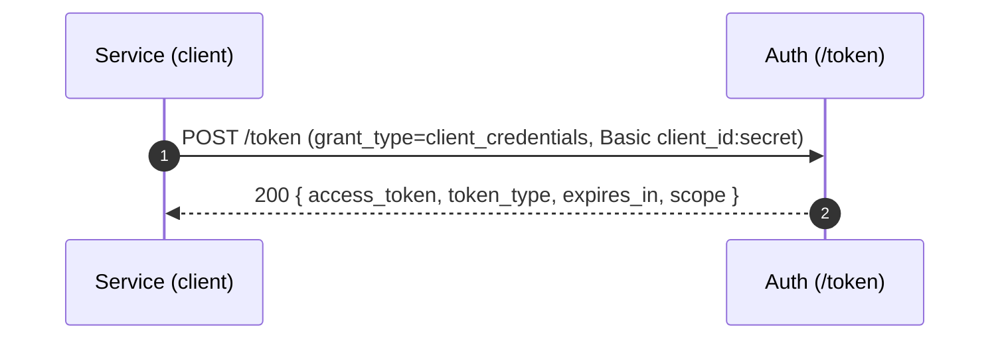
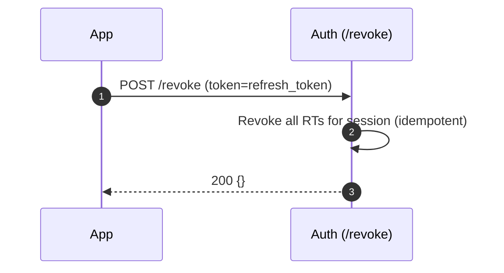

## What this module provides
- OIDC Provider at `https://api.novologic.co` (REST) for user login/session:
  - `/.well-known/openid-configuration`, `/jwks.json`
  - `/authorize` (code + PKCE), `/token` (code→token, refresh, client_credentials), `/userinfo`, `/introspect`, `/revoke`
  - `/login` (HTML form), `/consent` (HTML confirm scopes)
- GraphQL Admin API at `/graphql` (for internal consoles / back‑office):
  - `tenants()` list, `users(tenantId)`, `registerUser(input)` (more admin CRUD to be added)
- Sessions & refresh rotation, MFA (TOTP), RBAC scaffolding, audit logs

## Folder Documentation
- Root overview: `src/modules/auth/README.md`
- Submodules and deep docs: see each folder’s `README.md`:
  - `audit/`, `clients/`, `entities/`, `management/` (and its `controllers/`, `dtos/`), `mfa/`, `oidc/` (and its `controllers/`, `services/`, `views/`, `ui/`), `oidc-provider/`, `passwords/`, `rbac/`, `sessions/` (and its `services/`), `tokens/`
- Resource servers (Node/NestJS): `src/modules/auth/RESOURCE_SERVER_GUIDE.md`

## REST surface (for product/front‑end)

| Method | Path                                   | Purpose                            |
| :----: | :--------------------------------------| :----------------------------------|
| GET    | `/.well-known/openid-configuration`    | OIDC metadata (issuer, endpoints)  |
| GET    | `/jwks.json`                           | Public signing keys (RS256)        |
| GET    | `/authorize`                           | Start OAuth2 Authorization Code + PKCE redirect |
| GET    | `/login`                               | OP login form (email/password)     |
| GET    | `/consent`                             | Scope consent screen               |
| POST   | `/token` (form or JSON)                | `authorization_code` → tokens, `refresh_token`, `client_credentials` |
| GET    | `/userinfo` (Bearer access_token)      | Basic OIDC claims (sub, email, …)  |
| POST   | `/introspect`                          | RFC 7662 token status + selected claims |
| POST   | `/revoke`                              | Revoke refresh token               |

Scopes: `openid`, `profile`, `email`, `offline_access`  
Signing: RS256 with `kid`; JWKS at `/jwks.json`  
Access token `aud`: `novologic-api` (set in `TokenService`)  

Refresh / access cookies for browser flows:
- `rt`: HttpOnly refresh token cookie for first‑party clients (`Client.firstParty=true`, 30d)
- `at`: HttpOnly access token cookie (≈5m) for first‑party browser clients, used by GlobalAuthGuard when no Authorization header is present

### Machine-to-machine (client_credentials)



## Access token claim shape

User access tokens (issued for interactive users) contain:

- `sub: string` – user ID
- `org_id?: string` – active organisation (tenant) ID
- `sid?: string` – session ID
- `roles?: string[]` – role names within the active org
- `permissions?: string[]` – effective permission keys (derived from RBAC tables)
- `scope?: string` – OAuth2 scopes (space‑separated)
- Standard JWT fields: `iss`, `aud`, `exp`, `iat`, `nbf`

Client‑credentials access tokens (machine‑to‑machine) contain:

- `sub: string` – of the form `client:<clientId>`
- `org_id?: string` – tenant ID
- `scope?: string` – granted scopes
- `grant: 'client_credentials'`
- `azp: string` – authorized party (`clientId`)
- Standard JWT fields: `iss`, `aud`, `exp`, `iat`

> **TTL and staleness**  
> Access token TTL is ≈5 minutes. Embedded `permissions[]` reflect the RBAC
> state at issuance time and may lag RBAC changes until the token expires.
> The database (via `PermissionsService`) remains the source of truth.

Example (decoded user access token payload):

```json
{
  "sub": "user-uuid",
  "org_id": "tenant-uuid",
  "sid": "session-uuid",
  "roles": ["admin", "viewer"],
  "permissions": ["org:read", "org:write", "project:read"],
  "scope": "openid profile email offline_access",
  "iss": "https://api.novologic.co",
  "aud": "novologic-api",
  "iat": 1732250000,
  "exp": 1732250300
}
```

## Front‑end quick start (PKCE, SPA)

For a concrete Next.js example targeting `https://sandbox2.novologic.co`, see `src/modules/auth/FRONTEND_GUIDE.md`.

High‑level:

1. Register a first‑party SPA client (admin step):  
   - `clientId=app-spa`  
   - `redirect_uris=["https://sandbox2.novologic.co/auth/callback"]`  
   - `grant_types=["authorization_code","refresh_token"]`  
   - `firstParty=true`
2. Browser builds a PKCE pair and redirects user to `https://api.novologic.co/authorize`.
3. On callback, SPA exchanges `code` for tokens at `POST https://api.novologic.co/token` with `grant_type=authorization_code` and `credentials: 'include'`.
   - Response: `{ access_token, token_type, expires_in, refresh_token }`  
   - Cookies: `rt` (30d) + `at` (5m) are set for `.novologic.co`.
4. Product APIs at `https://api.novologic.co/v1/...` are called from the browser with `credentials: 'include'` and `x-tenant-id`, relying on `at` cookie.
5. Silent refresh: SPA calls `POST https://api.novologic.co/token` with `grant_type=refresh_token` and `credentials: 'include'` to rotate `rt` and refresh `at`.

## Data model (simplified)
- Tenant(id, slug, name, status)
- User(id, tenantId, email, passwordHash, mfaEnabled, status)
- Identity(id, email, passwordHash?, mfaEnabled, status, profile)
- Membership(id, identityId, tenantId, userId?, status)
- Role, Permission, UserRole, RolePermission
- Client(id, tenantId, clientId, clientSecretHash?, redirectUris[], grantTypes[], scopes[], firstParty)
- Session(id, tenantId, userId, device, ip, lastSeenAt)
- RefreshToken(id, tenantId, sessionId, tokenHash, expiresAt, rotatedFromId, revokedAt)
- Key(kid, alg, publicJwk, privateRef, notBefore, notAfter, status)
- AuditEvent(id, tenantId, actorId?, type, resource, metadata, createdAt)

## Request flow (high level)

```mermaid
flowchart LR
  A[Login] --> B[Authorize (code+PKCE)]
  B --> C[Token exchange]
  C -->|access_token| D[Frontend/API]
  C -->|refresh_token| E[Session]
  E --> F[Rotate RT on refresh]
  F -->|reuse detection| G[Revoke chain + alert]
```

Revocation:



Tenant resolution:
- `x-tenant-id` header (from gateway or frontend) → used if present
- else `x-tenant-id` / `tenant_id` query param (e.g. `/authorize?...&x-tenant-id=<tenant-uuid>`) → used
- else subdomain `https://{tenant}.novologic.co` → used (excluding infra hosts like `auth.novologic.co` and `api.novologic.co`)
- if host is `auth.novologic.co` or `api.novologic.co` and no header/query present, `tenant` cannot be inferred → frontends must provide `x-tenant-id` (header or query) on `/authorize`, `/token`, and API calls.

Security
- Passwords: Argon2; ID token/Access token: RS256 with rotating keys (JWKS)
- Refresh token rotation with reuse detection; HttpOnly cookie for 1st‑party SPAs
- Refresh fallback: `/token` accepts `refresh_token` from HttpOnly cookie `rt` when body param is absent (first‑party).
- CORS allowlist (incl. `*.novologic.co`), CSRF (double-submit) for form posts, rate limiting
- Confidential clients must authenticate at `/token` (Basic or body) when `clientSecretHash` is set.
- Scope requests are restricted to the client's allowed scopes at consent time.

Caching (no Redis required now)
- Permissions cache: in‑memory LRU with TTL=60s (`PermissionsService`) keyed by `(tenantId,userId)`.
- JWKS verify cache: in‑memory cache of imported public keys by `kid` (TTL=5m) to avoid DB hits on each verify.
- Both can be swapped to Redis later via a `CacheProvider` interface.

Tenancy enforcement
- `TenantStatusGuard` blocks requests for suspended tenants (applied on OIDC and Management modules).

Admin GraphQL (internal tooling)
- `/graphql` (Apollo): `tenants()`, `users(tenantId)`, `registerUser(input)`
- Extend with Role/Permission/Client admin as needed

## Path to centralized AuthZ

Today, permissions are:

- Computed inside the Auth module from the RBAC tables (`Role`, `Permission`, `UserRole`, `RolePermission`); and
- Embedded into access tokens as `permissions[]` for fast checks in Node/NestJS microservices.

In a future **centralized AuthZ** service, we can:

- Keep JWTs as the primary identity and tenancy carrier (`sub`, `org_id`, `roles`, `scope`); and
- Expose the same RBAC logic over HTTP/gRPC for live authorization decisions (e.g. `POST /authz/check`), with microservices calling it when they need stronger consistency than the cached `permissions[]` in the token.

## Changelog
- 2025‑11‑24: Added query-based tenant resolution for `/authorize` and `/token` (supports `x-tenant-id` / `tenant_id` query params; infra hosts `auth.novologic.co` and `api.novologic.co` no longer treated as tenant slugs); wired initial tenant/client seed tool and updated frontend guidance for sandbox2 → app migration.
- 2025‑11‑22: Added permissions to access tokens; updated docs with claim shape, resource-server link, and AuthZ roadmap.
- 2025‑11‑16: Added refresh cookie fallback; in‑memory caches (permissions, JWKS verify); TenantStatusGuard on OIDC/Management; GraphQL Auth guard (optional); E2E tests via Testcontainers.
- 2025‑11‑15: Added client_credentials grant; refresh token revocation; GlobalAuthGuard + AuthClaimsGuard; permission service (DB); tenant guard; CSRF on login/consent; failed-login tracking; RBAC management endpoints.
- 2025‑11‑08: Added org-scoped access token claims (`org_id`, `sid`, `roles`); client hardening (grant/scopes/secret checks); audit logs for login/consent; scaffolded `oidc-provider` module behind `OIDC_PROVIDER=true`; introduced `identities` and `memberships` tables with migrations.

